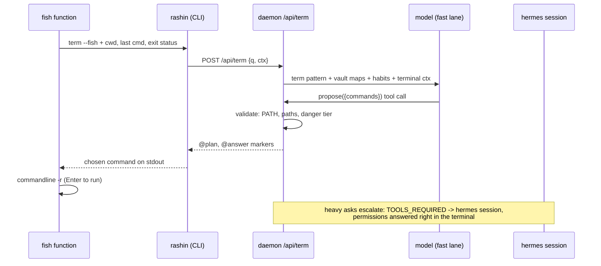

# Rashin in the terminal

The terminal lane wires the Rashin brain into the place Ryoku users actually
live: kitty running fish. One command, `rashin`, turns natural language into
answers and ready-to-run commands that know *this* machine, because they are
answered by the same daemon, the same vault, and the same Hermes connection as
the launcher's `\` ask and the dashboard chat. One brain, three surfaces.

```
$ rashin take me to the fastfetch config
  Fastfetch's config is ~/.config/fastfetch/config.jsonc, owned by ryoku-fastfetch.

  1 ◇ cd ~/.config/fastfetch && bat config.jsonc

$ cd ~/.config/fastfetch && bat config.jsonc█   <- sitting at your prompt, Enter runs it
```

Rashin never runs anything itself on this lane. It proposes; you press Enter.

## What it learned from the field

The design deliberately steals from and rejects parts of the existing tools:

| Tool | Takes | Leaves |
|---|---|---|
| shell-gpt, aichat | Buffer injection: the suggestion lands on the command line for review, via shell integration and a hotkey | A generic prompt with no machine knowledge |
| nlsh | Never auto-execute; the human is the executor | |
| butterfish | Terminal context rides along: cwd, last command, its exit status | Wrapping the whole shell in a PTY interceptor |
| Amazon Q CLI | Context-aware suggestions | The OSC/qterm input-interception layer (fights fish's own autosuggestions, huge surface) |
| atuin | Repetition is a signal: frequent history entries are alias candidates | A second history database |
| agent safety research | Tiered command classification (read / write / system / danger), deny-first | Allowlist-as-security theater: the user executes, so classification informs rather than gates |

None of them know the machine. Rashin does: the vault already maps every
config, owner, reload command, package, and the user's own divergences. The
terminal lane is that knowledge pointed at the prompt.

## The surface

`rashin` is the `ryoku-rashin` binary invoked under a second name (a symlink,
the busybox pattern); inside interactive fish a thin function shadows it to add
buffer injection. Everything meaningful lives in the daemon, so bash, zsh, and
SSH sessions get the same brain with plain-text output.

```
rashin <what you want>        ask; actionable asks come back as a command plan
rashin -c <follow-up>         continue the previous terminal exchange
rashin -r | --resume          list recent asks, recall one instantly (no model call)
rashin --last                 reprint the last answer and plan
rashin recipes                list learned shortcuts (fish abbreviations)
rashin recipe save <name>     save the last plan as a recipe
rashin recipe rm <name>       remove a recipe
```

Flags: `--copy` (put the plan's one-liner on the clipboard), `--run` (execute
here with tiered confirmation), `--fish` (porcelain: presentation on stderr,
final buffer text on stdout; what the fish function calls), `--plain` (no
ANSI; automatic when stdout is not a TTY). `rashin status|enable|disable|setup`
pass through to the matching `ryoku-rashin` verbs, so the short name never
surprises.

Also bound in fish: **Alt+R** transmutes the current command line. Type
`find every heic in Photos and convert to jpg`, hit Alt+R, and the buffer is
replaced by the proposed command. No quoting, no prefix.

## How an ask flows



1. The CLI collects terminal context: cwd, and (from the fish wrapper) the
   last command and its exit status. Nothing else leaves the process.
2. `POST /api/term` runs the **fast lane** (the same direct chat-completions
   loop as `/api/ask`, usually one or two seconds) with a terminal persona:
   the vault's generated maps, the habits layer, the terminal context, the
   read-only tools (`system_query`, `read_file`, `list_dir`, `search_code`,
   `fetch_url`), and one action tool: **`propose`**.
3. When the ask calls for terminal action, the model calls `propose` once with
   structured commands (`oneliner` when they chain safely). The daemon
   validates every command: the binary must be on PATH (else annotated with
   how to get it), checkable source paths must exist (else annotated), and
   each command gets a danger tier. The validated plan streams back as an
   `@plan` marker, then the model's one-sentence context as `@answer`.
4. Pure questions skip `propose` and come back as terse prose, same as the
   launcher lane.
5. Asks that need the full agent (editing file contents, images, browsing,
   skills, long multi-step work) escalate to the **session lane**: the shared
   pre-warmed Hermes session. On this lane the agent has no `propose` tool, so
   its preamble makes the contract explicit: **answer questions directly (it
   may read state to do so), but for anything that changes files or the system,
   propose the command in a fenced block and never run it.** The daemon lifts
   those commands into a plan (`planFromText`) and validates them the same way.
   The turn keeps running in the daemon even if the CLI detaches; `rashin
   --last`, `\resume`, and the dashboard all pick it up.

On an OAuth-only backend (openai-codex, native anthropic) the fast lane cannot
be called, so **every** terminal ask takes the session lane: correct output,
but seconds-to-tens-of-seconds latency where a direct-provider quick model
(`rashin.json` `quick.*`) answers in one or two. That trade is the provider's,
not the lane's.

Both lanes record into the shared transcript and the ask history
(`$XDG_STATE_HOME/ryoku/rashin-asks.jsonl`), so the launcher's `\resume`, the
terminal's `--resume`, and the dashboard's "continue in chat" all see the same
conversation. That is the synchronization contract: **every surface reads and
writes the same three stores** (transcript, ask history, vault).

## The stdout protocol

`/api/term` streams the ask-lane marker protocol with two additions:

```
@id <request id>          first line; keys cancel for this request
@working <label>          what the agent is doing right now
@plan <json>              the validated command plan (below)
@perm <json>              a session-lane permission request {id, title, options}
@answer <json>            {"text": ...}
@error <message>
@hint <json>              e.g. {"kind":"repeat","n":3} -> offer a recipe
```

The plan payload:

```json
{
  "intent": "move every .png from Documents into Pictures",
  "oneliner": true,
  "commands": [
    {
      "run": "fd -e png . ~/Documents -x mv {} ~/Pictures/",
      "why": "fd walks recursively; -x moves each hit",
      "tier": "write",
      "notes": ["~/Pictures exists (XDG Pictures directory)"]
    }
  ]
}
```

Tiers, computed per command and per pipeline segment, highest wins:

| Tier | Meaning | Examples | `--run` gate |
|---|---|---|---|
| `read` | looks, never touches | `eza`, `bat`, `fd`, `rg`, `df`, `pacman -Q` | y/N |
| `write` | changes user files | `mv`, `cp`, `mkdir`, `sed -i`, `git push` | y/N |
| `system` | root or service state | `sudo ...`, `pacman -S`, `systemctl enable` | y/N |
| `danger` | destructive or irreversible | `rm -rf` near `/` or `~`, `dd of=/dev/..`, `mkfs`, `curl \| sh` | type `yes` |

The classifier is deny-first and pessimistic: an unknown binary classifies as
`write`, never `read`. On the fish path the tier is informational (a colored
badge); the user is the executor and the buffer is the confirmation step. The
tier gates only `--run`.

Permissions stop dead-ending outside the dashboard: when an escalated turn
hits a Hermes `session/request_permission`, the terminal renders the options
and answers over `POST /api/perm` on the same request. The dashboard sees the
same request live; whoever answers first wins, the reply is sent exactly once.

## The learning loop

"Grows with use" is three concrete mechanisms, all local, all inspectable:

1. **The habits layer.** A new generated vault file, `habits.md`, joins
   `system.md` and friends: the user's XDG directories by their real names
   (`Pictures` -> `~/Pictures`, localized names included), the modern-stack
   substitutions in force (`ls`->`eza`, `cd`->zoxide, `find`->`fd`,
   `grep`->`rg`, `cat`->`bat`), shell rhythms mined from fish history (top
   commands with subcommand splits, secret-filtered, counts only), recent
   rashin usage, corrections, and saved recipes. It rides into the term *and*
   quick patterns, so both lanes speak the user's dialect, and every wired
   coding agent reads it from the vault for free. Regenerated with the cheap
   two-minute user-layer watcher; the history mining is opt-out
   (`habits.history: false` in `rashin.json`).
2. **The correction report.** When a rashin-injected command is edited before
   running, or fails, the fish hook reports what actually ran and its exit
   status (`/api/term/ran`, loopback, fire-and-forget, only for commands
   rashin itself injected). Proposed-vs-ran pairs land in
   `rashin-runs.jsonl` and surface in `habits.md`, so the model sees its own
   misses on the next ask.
3. **Recipes.** The daemon normalizes ask text and counts near-duplicates;
   the third similar ask streams a `@hint` and the CLI offers
   `rashin recipe save <name>`. A recipe pins the plan as a fish abbreviation
   (`rr-<name>`, expanded inline so the user always sees what runs) in a
   state file the shipped conf.d snippet sources. `rashin recipes` lists them;
   `habits.md` names them so the model suggests the abbreviation instead of
   re-deriving the pipeline.

## The fish weave

One shipped file, `~/.config/fish/conf.d/rashin.fish` (source:
`ryoku/apps/fish/conf.d/rashin.fish`), containing four small pieces:

- `function rashin` wraps the binary in interactive shells: runs
  `ryoku-rashin term --fish -- $argv` with the terminal context, lets the
  presentation stream to the tty, and if stdout carries a buffer payload,
  `commandline -r -- $payload; commandline -f repaint`. Outside interactive
  use it execs the binary unchanged.
- The **Alt+R** binding sends the current buffer as the ask and replaces it
  with the result.
- `__rashin_ran`, a `fish_postexec` hook that reports the executed command
  and `$status` back to the daemon, only when the previous buffer came from a
  rashin injection (a session-scoped flag the wrapper sets and the hook
  clears).
- The recipes loader: `source $XDG_STATE_HOME/ryoku/rashin-recipes.fish` when
  present.

The function and hook are no-ops when the daemon is down; nothing blocks the
shell. Everything degrades to the bare binary on machines without fish.

## When things are not ideal

The lane is designed against the messy cases, not the demo:

| Situation | Behavior |
|---|---|
| Daemon not running / rashin disabled | One line: how to enable (Settings -> Advanced -> Rashin, or `ryoku-rashin enable`), exit 1 |
| Hermes never set up, no quick override | Fast lane resolves nothing: the error says to run the one-click setup |
| Provider is OAuth-only (openai-codex) | Same as the launcher: asks ride the session lane, slower but identical output |
| Provider endpoint down / bad key | Fast lane fails -> session lane; if that dies too, `@error` with the reason |
| Ctrl+C mid-ask | CLI answers `@id` with `POST /api/term/cancel?id=`, the daemon stops that request only; concurrent terminals never cancel each other |
| stdout piped / not a TTY | Plain text, no ANSI, no prompts, plan printed inline (script-safe) |
| Model proposes a binary that is not installed | Note on the command: `magick: not installed`; the pattern tells the model to prefer what is |
| Model proposes a missing source path | Note: `~/Dokumente does not exist`; destination paths are exempt (mkdir targets are *supposed* to be new) |
| Model answers with fenced commands instead of `propose` | The daemon lifts fenced/`$ `-prefixed lines into a plan and validates them the same way |
| Multiple proposed steps | Numbered plan; interactive pick (Enter = first, `a` = all joined with `&&`, number = that step, `q` = none) |
| Empty ask / Alt+R on an empty buffer | Usage line, no model call |
| Renamed or localized XDG dirs (`Bilder`, `Documenten`) | `habits.md` carries the real names from `user-dirs.dirs`; the model uses those |
| Secrets in shell history | History mining drops lines matching credential patterns before counting; only argv0/subcommand counts ever leave the parse |
| `wl-copy` missing (non-Wayland session) | `--copy` falls back to printing the line |
| Two asks from two terminals at once | Independent requests, independent cancels; the transcript interleaves both, as one user would expect |

## What stays out, and why

- **No PTY wrapping, no OSC layer, no ghost text.** fish already has
  autosuggestions; a second input layer fights it (Amazon Q documents exactly
  this conflict). The function + one keybind get the value at 1% of the
  surface.
- **No auto-execution, ever, on the terminal lane.** The buffer is the
  confirmation. `--run` exists for scripts and the confirm tiers gate it.
- **No second history database.** fish history and the existing ask JSONL are
  the signal; atuin can join later as an optional source.
- **No new daemon.** The terminal lane is three handlers on the existing
  `ryoku-rashin` daemon; the CLI is a viewer, exactly like the launcher ask.
- **No abbreviations written into user files.** Recipes materialize into a
  rashin-owned state file the conf.d snippet sources; `user.fish` and
  `config.fish` stay untouched.
